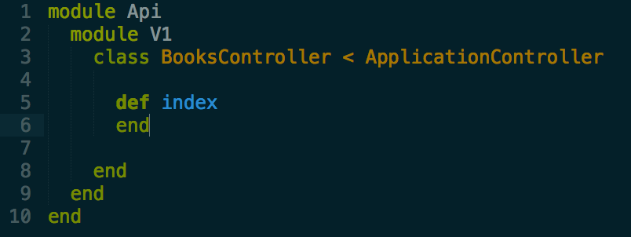
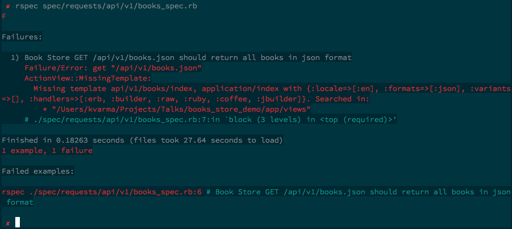

> [<< BACK: 6. Defining Routes](step-6-first-route.md)

> [>> NEXT: 8. The Render Method](step-8-understanding-the-render-method.md)

resoureces :books will give

get     '/api/v1/books'           => "api/v1/books#index",    as: api_v1_books

rails will expect a controller in this path => "api/v1/books#index".

It is throwing error because if is unable to find books controller and index action in it under api/v1 module

let us create api/v1 module first and then create our first controller i.e books controller.rb

Let us run it again

$ rspec spec/requests/api/v1/books_spec.rb

The action 'index' could not be found for Api::V1::BooksController

We haven't defined the action index.
Let us do it.

Let us run it again

$ rspec spec/requests/api/v1/books_spec.rb

Missing template api/v1/books/index

> [<< BACK: 6. Defining Routes](step-6-first-route.md)

> [>> NEXT: 8. The Render Method](step-8-understanding-the-render-method.md)

