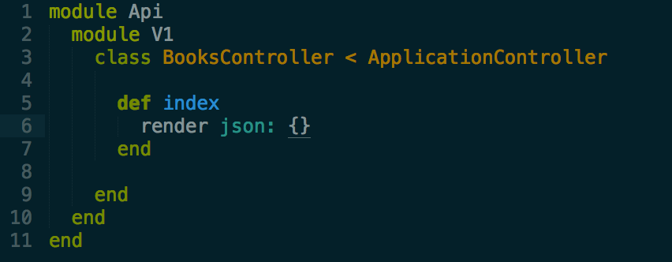

> [<< 7. Implementing the first Controller](step-7-first-controller.md)

> [>> 9. Implement the User Story](step-9-implement-user-story.md)

# Understanding the render method

Rails believes in convention over configuration

By default rails will look for a template in views folder
Our views folder is empty.

Here in our case, rails will try to look for api/v1/books/index.json.

Instead of creating a static index.json file, let us depend on render method in rails to generate a json dynamically.

Let us first render a black json to get things going.

$ rspec spec/requests/api/v1/books_spec.rb

> [<< 7. Implementing the first Controller](step-7-first-controller.md)

> [>> 9. Implement the User Story](step-9-implement-user-story.md)